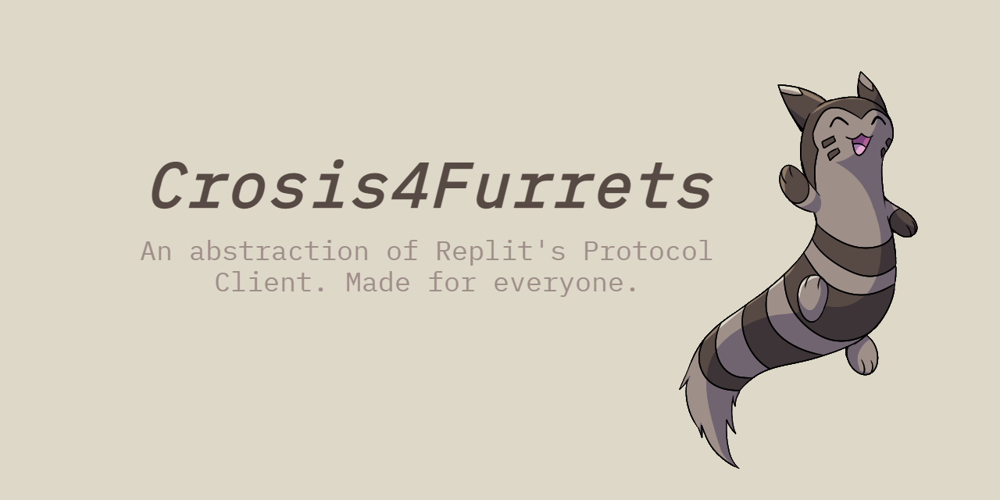

# Crosis4Furrets

An abstraction layer on top of [@replit/crosis](https://www.npmjs.com/package/@replit/crosis)
that makes Repl connection management and operations so easy, a Furret could do it! :tada:

## Install

```sh
# with NPM
$ npm install crosis4furrets

# with Yarn
$ yarn add crosis4furrets
```

## Usage

### Main API

```js
import { Client } from 'crosis4furrets';
const client = new Client({
  token: process.env.REPLIT_TOKEN,
  replId: process.env.REPLIT_REPL_ID,
});
```

which returns a [`<Client>`](#client). See [DOCUMENTATION.md](./DOCUMENTATION.md) for docs on how
to use Crosis4Furrets.

## Example

```js
import { Crosis } from 'crosis4furrets';

const client = new Crosis({
  token: process.env.REPLIT_TOKEN,
  replId: 'xxxxxxxx-xxxx-xxxx-xxxx-xxxxxxxxxxxx',
});

await client.connect();
console.log('Read:\n', await client.read('index.js', 'utf-8'));
```

### Access Keys

Run the following command in your Repl to get its **Repl ID**:

```bash
$ echo $REPL_ID
```

or alternatively make a [GraphQL Request](https://replit.com/graphql)
with the following query:

```graphql
query ReplID ($url: String) {
  repl(url: $url) {
    ...on Repl { id }
  }
}
```

```json
{
  "url": "/@<username>/<repl_slug>"
}
```

To get a **Replit Token**, you can visit [this Repl](https://login-test.rayhanadev.repl.co).

## Contributing

This project is in active development and we would love some :sparkles: fabulous
:sparkles: contributions! To get started, visit our [Contributing](https://github.com/rayhanadev/crosis4furrets/blob/main/CONTRIBUTING.md)
documentation.

## Licensing

This project is licensed under the MIT License. For more information, see [LICENSE](https://github.com/rayhanadev/crosis4furrets/blob/main/LICENSE).
